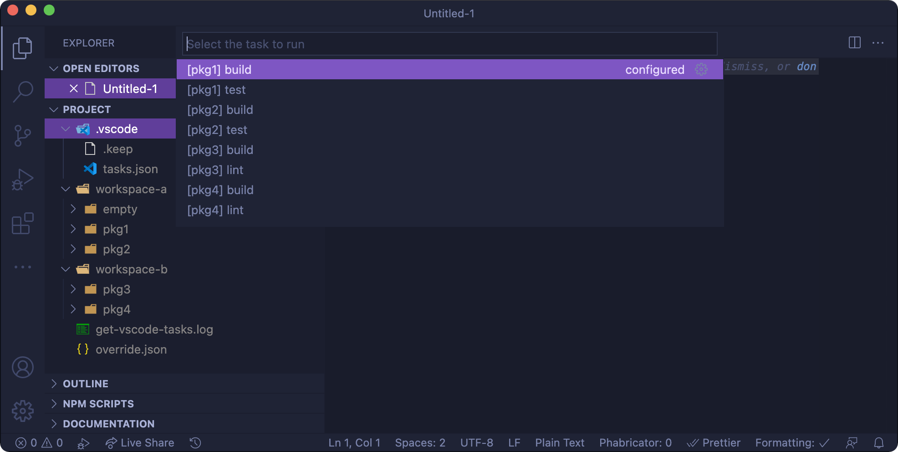
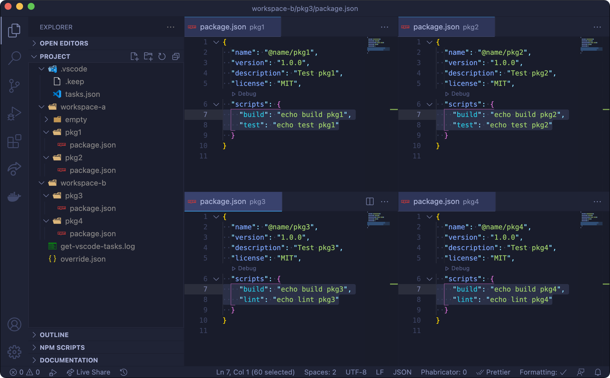

<h1 align="center" style="border-bottom: none;">gen-vscode-tasks</h1>
<h3 align="center">Generate VSCode tasks.json from workspace package scripts</h3>
<p align="center">
  <a href="https://github.com/psyrendust/gen-vscode-tasks/actions?query=workflow%3ATest+branch%3Amaster">
    
  </a>
  <a href="https://github.com/psyrendust/gen-vscode-tasks/actions?query=workflow%3ARelease+branch%3Amaster">
    
  </a>
  <a href="https://github.com/psyrendust/gen-vscode-tasks/blob/master/LICENSE">
    
  </a>
  <a href="https://www.npmjs.com/package/@psyrendust/gen-vscode-tasks">
    
  </a>
</p>

**gen-vscode-tasks** generates a `tasks.json` from workspace package scripts for projects that use multiple workspaces.
This allows developers to execute `Run Task...` commands in VSCode for any npm scripts found in the package workspaces.

#### VSCode Run Task

<p align="center">
  
</p>

#### VSCode package.json scripts

<p align="center">
  
</p>

## Install

```
$ npm install --global @psyrendust/gen-vscode-tasks
```

## Usage

```
$ gen-vscode-tasks --help

  Usage
    $ gen-vscode-tasks [options]
    $ gen-vscode-tasks --workspace <workspace> --save <path>
    $ gen-vscode-tasks --workspace <workspace> --filter <filter> --save <path>
    $ gen-vscode-tasks --workspace <workspace> --filter <filter> --override <override> --save <path>

  Options
    --workspace, -w   Generate tasks for each package within a workspace.
    --filter, -f      Generate tasks for workspace packages that only match the filter.
    --save, -s        Save the output to <path>
    --override, -o    Path to a json you wish to use to override each task config.
                      The following fields are not configurable: [label, command, options.cwd]

  Flags
    --npm             Use 'npm run' vs 'yarn'.
    --no-sort         Do not sort tasks alphabetically.
    --verbose         Verbose output.
    --help            Show this help message.

  Args
    <path>            The folder to save tasks.json to, typically '.vscode/tasks.json'.
    <workspace>       Workspace path.
    <filter>          Name of the package to include when searching a workspace.
    <override>        Path to a json you wish to use to override each task config.

  Examples
    Given the following project:

      ./test/fixtures/project
      ├── .vscode
      │   └── tasks.json
      ├── workspace-a
      │   ├── empty
      │   │   └── .keep
      │   ├── pkg1
      │   │   └── package.json
      │   └── pkg2
      │       └── package.json
      └── workspace-b
          ├── pkg3
          │   └── package.json
          └── pkg4
              └── package.json

    $ cd ./test/fixtures/project

    # Will write to stdout with tasks for pkg1,pkg2
    $ gen-vscode-tasks --workspace ./workspace-a

    # Will save to ./.vscode/tasks.json with tasks for pkg1,pkg2
    $ gen-vscode-tasks --workspace ./workspace-a --save ./.vscode/tasks.json
    $ gen-vscode-tasks -w ./workspace-a -s ./.vscode/tasks.json

    # Will save to ./.vscode/tasks.json with tasks for pkg1,pkg2,pkg3,pkg4
    $ gen-vscode-tasks -w ./workspace-a -w ./workspace-b -s ./.vscode/tasks.json

    # Will save to ./.vscode/tasks.json with tasks for pkg1,pkg4
    $ gen-vscode-tasks -w ./workspace-a -w ./workspace-b -f pkg1 -f pkg4  -s ./.vscode/tasks.json

    $ gen-vscode-tasks --help
```

## Maintainers

- [Larry Gordon](https://github.com/psyrendust)

## License

MIT
